# MultiFlexi CLI

[](https://github.com/VitexSoftware/multiflexi-cli/actions/workflows/php.yml)
[](https://opensource.org/licenses/MIT)
[](https://github.com/VitexSoftware/multiflexi-cli/commits/main)


[](https://multiflexi.eu)

MultiFlexi CLI (`multiflexi-cli`) is a command-line tool for managing MultiFlexi applications, jobs, users, companies, and more. It is designed to provide flexible automation and integration for MultiFlexi server environments.

## Features
- List, create, get, and delete entities such as applications, jobs, users, companies, and credentials.
- Query application and job status.
- Manage templates, tokens, and queues.
- **JSON Import/Export**: Import applications and credential types from JSON files, export configurations to JSON.
- **Encryption management**: Check status and initialize encryption keys for secure credential storage.
- Prune obsolete data.
- Internationalization support (i18n).
- **Flexible output formats**: Human-readable text output by default, with optional JSON output for integration (`--format json`).

## Usage

```bash
multiflexi-cli <command> [options]
```

## Common Commands

| Command | Description |
|---|---|
| `application:list` | List all applications |
| `application:get --id <id>` | Get application details |
| `application:import-json --file <file>` | Import application from JSON |
| `application:export-json --id <id> --file <file>` | Export application to JSON |
| `run-template:list` | List run templates |
| `run-template:schedule --id <id>` | Schedule a run template as a job |
| `run-template:schedule --id <id> --env KEY=VALUE` | Schedule with one-time env override |
| `job:list` | List jobs |
| `job:get --id <id>` | Get job details |
| `job:status --id <id>` | Get job status |
| `company:list` | List companies |
| `company-app:list` | List company–application assignments |
| `credential-type:list` | List credential types |
| `credential-type:import-json --file <file>` | Import credential type from JSON |
| `user:list` | List users |
| `user:create --login <login> --email <email>` | Create a user |
| `token:list` | List API tokens |
| `event-source:list` | List event sources |
| `event-rule:list` | List event rules |
| `queue:overview` | Show queue metrics |
| `queue:list` | List scheduled queue entries |
| `queue:fix` | Fix orphaned jobs |
| `encryption:status` | Show encryption status |
| `encryption:init` | Initialize encryption keys |
| `telemetry:test` | Test OpenTelemetry export |
| `prune` | Remove obsolete data |
| `status` | Show overall system status |
| `describe` | List all available commands |

## Output Formats

All commands default to human-readable text. Use `--format json` for machine-readable output.

## Examples

```bash
# Applications
multiflexi-cli application:list
multiflexi-cli application:get --id 19 --format json
multiflexi-cli application:import-json --file app-definition.json
multiflexi-cli application:delete --id 456

# Run templates
multiflexi-cli run-template:list
multiflexi-cli run-template:schedule --id 167
multiflexi-cli run-template:schedule --id 167 --env IMPORT_SCOPE=2025-11-01>2026-01-07

# Jobs
multiflexi-cli job:list
multiflexi-cli job:get --id 123 --format json
multiflexi-cli job:status --id 123

# Users
multiflexi-cli user:create --login "jsmith" --email "john@example.com"
multiflexi-cli user:list --format json

# Credential types
multiflexi-cli credential-type:list
multiflexi-cli credential-type:get --uuid "d3d3ae58-d64a-4ab4-afb5-ba439ffc8587"
multiflexi-cli credential-type:import-json --file credential-type.json

# Event sources and rules
multiflexi-cli event-source:list
multiflexi-cli event-source:create --name "Webhooks" --db_database webhooks --db_host localhost
multiflexi-cli event-source:test --id 1
multiflexi-cli event-rule:list
multiflexi-cli event-rule:create --event_source_id 1 --evidence faktura-vydana --operation create --runtemplate_id 42

# Queue
multiflexi-cli queue:overview
multiflexi-cli queue:list --order after --limit 10
multiflexi-cli queue:list --fields "id,after,schedule_type" --format json
multiflexi-cli queue:fix

# System
multiflexi-cli encryption:status
multiflexi-cli status --format json
multiflexi-cli telemetry:test
```

## Documentation
For detailed documentation, see [`doc/multiflexi-cli.rst`](doc/multiflexi-cli.rst) and the man page `multiflexi-cli.1`.

## MultiFlexi

MultiFlexi CLI is part of a [MultiFlexi](https://multiflexi.eu) suite.

[](https://www.multiflexi.eu/)

## License
MultiFlexi CLI is licensed under the MIT License.
